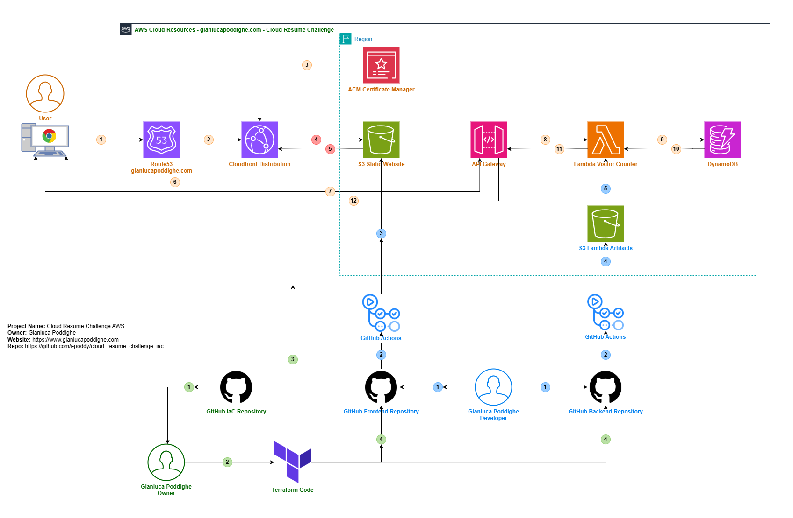

# CLOUD RESUME CHALLENGE - INFRASTRUCTURE

## Architecture components overview

The project consists of the following components:

- **Frontend**: A static website built with HTML, CSS, and JavaScript, hosted on Amazon S3 and served via Amazon CloudFront.
- **Backend**: A serverless API implemented using AWS API Gateway, AWS Lambda (Python), and AWS DynamoDB to track visitor count.
- **CI/CD**: GitHub Actions to deploy the Frontend and Backend code to the S3 for the static website and the lambda function respectively.
- **Infrastructure as Code**: Provisioned using Terraform for repeatability and automation.

## Architecture Diagram

The Diagram represent the architecture implemented for my Cloud Resume Challenge. 
I have used three different colors to represent the four main components of the infrastrucuture and the workflows.

### Infrastructure as Code

**1.** From the GitHub IaC repository, the Owner downloads the Source Code.  
**2.** The Owner of the Project runs the Terraform code with the appropriate variables.  
**3.** Terraform creates the AWS Cloud Resources.  
**4.** Terraform creates the secrets and variables in GitHub Frontend and Backend repositories to be used by the GitHub Actions.  

### Frontend and Backend Source Code and CI/CD  

**1.** The Developer commits the code to the Frontend and Backend repositories.  
**2.** The Commit event in the Frontend or Backend repositories triggers the GitHub Action execution.  
**3.** The Frontend GitHub Action uses the variables set by Terraform, modifies the JavaScript file with the API Gateway Endpoint, and deploys the code to the S3 static website bucket.  
**4.** The Backend GitHub Action zips the Python code and uploads it to an S3 bucket created for artifacts.  
**5.** The Backend GitHub Action gets the `.zip` artifact and deploys it to the Lambda Function.  

### Frontend and Backend Resources  

**1.**  The user (or visitor) accesses [My Cloud Resume Challenge Website](https://gianlucapoddighe.com/), and their browser queries the DNS server.  
**2.**  The DNS, implemented with the Route 53 service, forwards the request to the CloudFront Distribution Endpoint.  
**3.**  The CloudFront Distribution uses ACM to get the certificate to serve the content over HTTPS.  
**4.**  (Conditional) If the user's request results in a **cache miss** on the CloudFront Distribution cache, the CloudFront Distribution retrieves the content from S3.  
**5.**  (Conditional) S3 returns the website content to the CloudFront Distribution.  
**6.**  The DNS, implemented with the Route 53 service, forwards the request to the CloudFront Distribution Endpoint.  
**7.**  The user's browser displays the website and executes the JavaScript, which performs a request to the API Gateway to retrieve the Visitor Counter, initially showing **Loading**.  
**8.**  The API Gateway forwards the request to the Lambda function and triggers its execution.  
**9.**  The Lambda function retrieves the visitor count from the DynamoDB table.  
**10.** DynamoDB returns the visitor counter to the Lambda function.  
**11.** The Lambda function returns the visitor counter to the API Gateway.  
**12.** The API Gateway returns the visitor counter to the user's browser, which displays it along with the website content.  