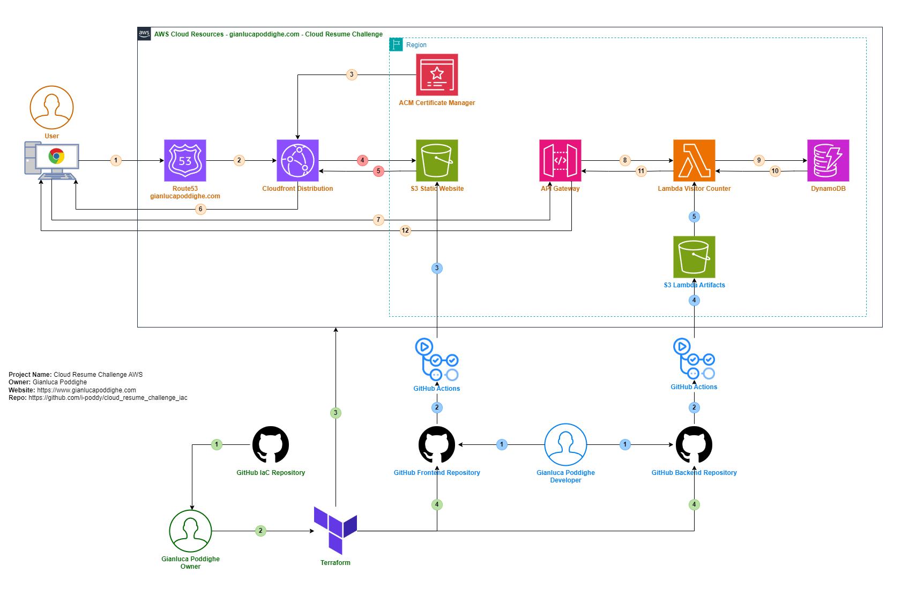

# CLOUD RESUME CHALLENGE - INFRASTRUCTURE

## Architecture components overview

The project consists of the following components:

- **Frontend**: A static website built with HTML, CSS, and JavaScript, hosted on Amazon S3 and served via Amazon CloudFront.
- **Backend**: A serverless API implemented using AWS API Gateway, AWS Lambda (Python), and AWS DynamoDB to track visitor count.
- **CI/CD**: GitHub Actions to deploy the Frontend and Backend code to the S3 for the static website and the lambda function respectively.
- **Infrastructure as Code**: Provisioned using Terraform for repeatability and automation.

## Architecture Diagram

The Diagram represent the architecture implemented for my Cloud Resume Challenge. 
I have used three different colors to represent the four main components of the infrastrucuture and the workflows.

### Infrastructure as Code: Green

- 1 From GitHub IaC repository the Owner download the Source Code
- 2 The Owner of the Project runs the Terraform code with the appropriate variables
- 3 Terraform creates the AWS Cloud Resources
- 4 Terraform creates the secrets and variables in GitHub Frontend and Backend repositories to be used by the GitHub Actions

### Frontend and backend source code and CI/CD: Blue

- 1 The Developer commits the code to the Frontend and Backend repositories  
- 2 The Commit event in the Frontend or in the Frontend repositories trigger the GitHub Action execution
- 3 The Frontend GitHub Action uses the variables set by terraform, modify the Javascipt file with the API Gateway Endpoint, and deploys the code to the S3 static website bucket
- 4 The Backend GitHub Action zip the python code and upload it to a S3 bucket created for artifacts
- 5 The Backend GitHub Action get the .zip artifact and deploys it to the Lambda Function

### Frontend and Backend resources: Orange

- 1 The user (or visitor) access [cloud Resume Challenge](https://cloudresumechallenge.dev/) and his browser queries the DNS server
- 2 The DNS implemented with the Route53 service forward him to the Cloudfront Distribution Endpoint
- 3 The Cloudfront Distribution uses ACM to get the certificate to serve the content in HTTPS  
- 4 (Conditional)  **if** the user request is a **cache miss** on the Cloudfront Distribution cache, the CloudFront Distribution get the content from S3  
- 5 (Conditional)  S3 return the Website content to the Cloudfront Distribution
- 6 The DNS implemented with the Route53 service forward him to the Cloudfront Distribution Endpoint
- 7 The user browser displays the website to the user and executes the Javasciript which perform a request to the API Gateway to retrieve the Visitor Counter which is now showing **Loading**
- 8 The API Gateway forward the request to the Lambda function and triggers its execution
- 9 The Lambda function retrieve the visitor count from the DynamoDB table 
- 10 The DynamoDB return the visitor counter to the Lambda function
- 11 The Lambda function return the visitor counter to the API Gateway
- 11 The API Gateway return the visitor counter to the user browser which will display it to the user along with the website